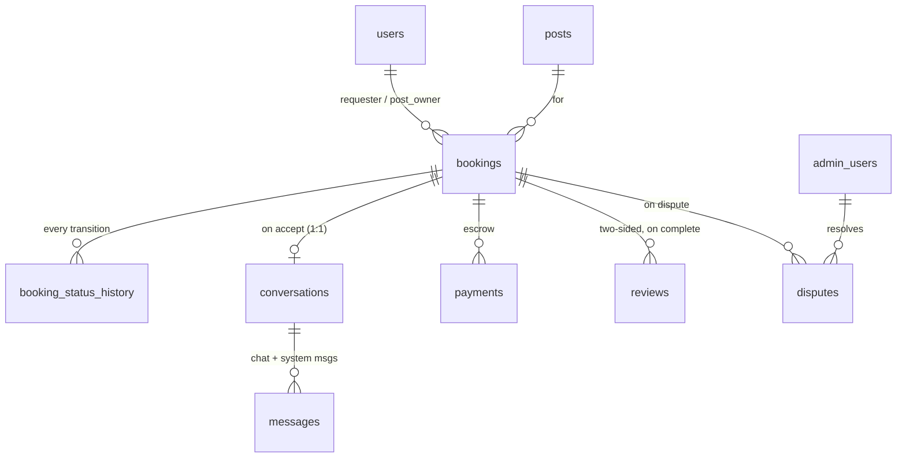
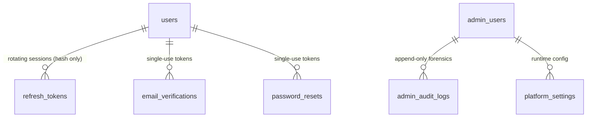

# GoodsGo — Entity–Relationship Diagram

> Mermaid ER diagram of the full schema (migrations 001–020). GitHub, VS Code
> (with a Mermaid extension), and most Markdown viewers render this natively. Key
> columns are shown; see [DATABASE_GUIDE.md](./DATABASE_GUIDE.md) for the complete
> column list, indexes, constraints, and enum values.
>
> Legend: `PK` primary key · `FK` foreign key · `UK` unique. Crow's-foot
> cardinality: `||--o{` = one-to-many · `||--o|` = one-to-one (optional) ·
> `}o--||` reversed. Reference tables (`vehicle_types`, `goods_categories`) have
> no FK edges — posts reference them by string value, validated in the app layer.

---

## 1. Full schema

```mermaid
erDiagram
    users ||--o{ refresh_tokens        : "has"
    users ||--o{ email_verifications   : "has"
    users ||--o{ password_resets       : "has"
    users ||--o{ posts                 : "creates"
    users ||--o{ saved_posts           : "saves"
    users ||--o{ reported_posts        : "reports"
    users ||--o{ notifications         : "receives"
    users ||--o{ bookings              : "requests (requester_id)"
    users ||--o{ bookings              : "owns post (post_owner_id)"
    users ||--o{ reviews               : "writes/receives"
    users ||--o{ payments              : "pays/receives"
    users ||--o{ disputes              : "raises"

    posts ||--o{ post_images           : "has"
    posts ||--o{ saved_posts           : "saved in"
    posts ||--o{ reported_posts        : "reported in"
    posts ||--o{ bookings              : "booked via"

    bookings ||--o{ booking_status_history : "audited by"
    bookings ||--o| conversations      : "opens (1:1)"
    bookings ||--o{ reviews            : "reviewed via"
    bookings ||--o{ payments           : "paid via"
    bookings ||--o{ disputes           : "disputed via"

    conversations ||--o{ messages      : "contains"

    admin_users ||--o{ reported_posts  : "reviews (reviewed_by)"
    admin_users ||--o{ disputes        : "resolves (resolved_by)"
    admin_users ||--o{ platform_settings : "updates (updated_by)"
    admin_users ||--o{ admin_audit_logs : "acts (admin_id)"

    users {
        uuid    id PK
        string  email UK
        string  phone UK
        text    password_hash
        string  full_name
        text    profile_image_url
        bool    is_email_verified
        bool    is_identity_verified
        bool    is_active
        timestamptz suspended_at
        decimal rating
        int     total_reviews
        int     cancellation_count
        timestamptz deleted_at
        timestamptz created_at
    }

    refresh_tokens {
        uuid    id PK
        uuid    user_id FK
        text    token_hash UK "SHA-256 of the JWT"
        timestamptz expires_at
        timestamptz revoked_at
        string  revoked_reason
    }

    email_verifications {
        uuid    id PK
        uuid    user_id FK
        string  token UK "64-char hex, single-use"
        timestamptz expires_at
        timestamptz used_at
    }

    password_resets {
        uuid    id PK
        uuid    user_id FK
        string  token UK
        timestamptz expires_at
        timestamptz used_at
    }

    posts {
        uuid    id PK
        uuid    user_id FK
        enum    post_type "need_transport|vehicle_available|return_journey"
        enum    status "active|inactive|booked|completed|expired|deleted"
        text    origin_address
        decimal origin_lat
        decimal origin_lng
        text    destination_address
        string  vehicle_type
        decimal vehicle_capacity_kg
        string  goods_category
        decimal goods_weight_kg
        bool    is_fragile
        decimal budget_min
        decimal budget_max
        decimal price_expectation
        date    availability_date
        timestamptz expires_at
        int     view_count
        timestamptz deleted_at
    }

    post_images {
        uuid    id PK
        uuid    post_id FK
        text    image_url
        string  cloudinary_public_id
        smallint display_order
    }

    saved_posts {
        uuid    id PK
        uuid    user_id FK
        uuid    post_id FK
    }

    reported_posts {
        uuid    id PK
        uuid    reporter_id FK
        uuid    post_id FK
        enum    reason
        enum    status
        uuid    reviewed_by FK "admin_users"
    }

    bookings {
        uuid    id PK
        uuid    post_id FK
        uuid    requester_id FK
        uuid    post_owner_id FK
        enum    status "9-state machine"
        decimal agreed_price
        decimal platform_commission_pct "snapshot"
        decimal platform_commission_amt
        decimal net_payout
        date    scheduled_date
        timestamptz payment_deadline
        uuid    cancelled_by FK
        timestamptz accepted_at
        timestamptz completed_at
        timestamptz created_at
    }

    booking_status_history {
        uuid    id PK
        uuid    booking_id FK
        enum    from_status "null on create"
        enum    to_status
        uuid    changed_by FK "null=system"
        text    reason
        jsonb   metadata
        timestamptz created_at
    }

    conversations {
        uuid    id PK
        uuid    booking_id FK UK "1:1 with booking"
        uuid    participant_1_id FK
        uuid    participant_2_id FK
        enum    status "active|locked|archived"
        timestamptz last_message_at
        string  last_message_preview
    }

    messages {
        uuid    id PK
        uuid    conversation_id FK
        uuid    sender_id FK "null=system"
        text    content
        enum    message_type "text|image|system"
        text    image_url
        bool    is_read
        timestamptz created_at
    }

    reviews {
        uuid    id PK
        uuid    booking_id FK
        uuid    reviewer_id FK
        uuid    reviewee_id FK
        smallint rating "1-5"
        text    comment
        enum    review_role "as_customer|as_transporter"
        bool    is_visible
    }

    payments {
        uuid    id PK
        uuid    booking_id FK
        uuid    payer_id FK
        uuid    payee_id FK
        decimal amount
        decimal platform_commission_amt
        decimal net_payout_amt
        enum    status "pending..refunded"
        string  gateway_order_id
        string  gateway_payment_id UK
        text    gateway_signature
        timestamptz auto_release_at
    }

    notifications {
        uuid    id PK
        uuid    user_id FK
        enum    type "17 values"
        string  title
        text    body
        jsonb   data "deep-link entity ids"
        bool    is_read
        timestamptz created_at
    }

    disputes {
        uuid    id PK
        uuid    booking_id FK
        uuid    raised_by FK
        string  reason
        text    description
        jsonb   evidence_urls
        enum    status
        uuid    resolved_by FK "admin_users"
        timestamptz resolved_at
    }

    admin_users {
        uuid    id PK
        string  email UK
        text    password_hash
        string  full_name
        enum    role "super_admin|admin|moderator"
        bool    is_active
        timestamptz last_login_at
    }

    platform_settings {
        string  key PK
        text    value
        string  value_type "string|number|boolean|json"
        text    description
        uuid    updated_by FK "admin_users"
    }

    admin_audit_logs {
        uuid    id PK
        uuid    admin_id FK "set null on admin delete"
        string  action_type
        string  target_type
        uuid    target_id
        inet    ip_address
        jsonb   metadata
        timestamptz created_at
    }

    vehicle_types {
        uuid    id PK
        string  name UK "code stored on posts"
        string  label
        bool    is_active
        smallint display_order
    }

    goods_categories {
        uuid    id PK
        string  name UK
        string  label
        bool    is_active
        smallint display_order
    }
```

---

## 2. Focused view — the booking lifecycle cluster

The transactional core. `bookings` is the hub; a booking spawns a conversation, an
audit trail, up to two reviews, a payment, and (optionally) a dispute.



---

## 3. Focused view — identity & auth



`users` and `admin_users` are **deliberately separate** identity domains (separate
tables + separate JWT secrets) — the privilege-separation boundary. See
[SECURITY_GUIDE.md §2](./SECURITY_GUIDE.md).

---

## 4. Notes for readers

- **Two FKs from `users` to `bookings`** (`requester_id`, `post_owner_id`) — one
  user can appear on either side of a booking. Which side is the "shipper" vs the
  "transporter" **flips by `post_type`** (see BOOKINGS_LINE_BY_LINE §4.8).
- **`conversations.booking_id` is UNIQUE** → exactly one conversation per booking
  (rendered as the `o|` one-to-one edge).
- **Deferred FK:** `reported_posts.reviewed_by → admin_users` is added at the end
  of migration 017 (the table is created in 016, before `admin_users` exists).
- **Reference tables** (`vehicle_types`, `goods_categories`) have no FK edges by
  design — `posts` store the string `name`, validated in the app layer against the
  frozen `VEHICLE_TYPES` / `GOODS_CATEGORIES` lists, so the feed query needs no
  join.
- **Cascade vs set-null:** owned children cascade on delete; audit/reference links
  (`changed_by`, `sender_id`, `raised_by`, `resolved_by`, `admin_id`,
  `reviewed_by`, `updated_by`) use `SET NULL` to preserve history. See
  DATABASE_GUIDE §4.
